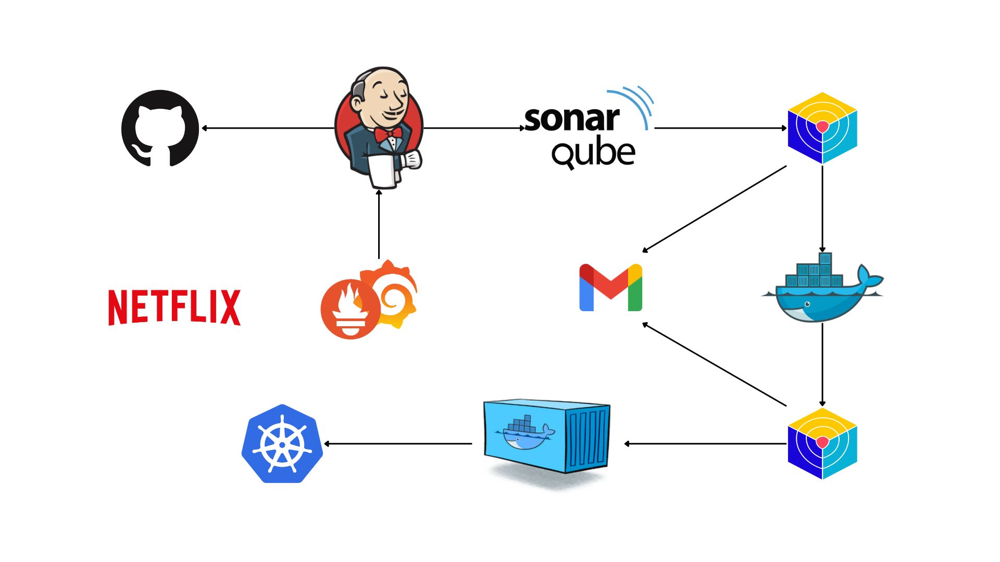

# 🚀 Netflix-DevSecOps-Automation Project! 🌐

## 📜 Overview
This project demonstrates a complete DevSecOps pipeline to deploy a Netflix clone application on the cloud. Using Azure VMs for hosting, Docker for containerization, Jenkins for CI/CD automation, and Prometheus and Grafana for monitoring, this pipeline covers development, security, and operations phases, creating a secure and scalable deployment environment.

## 🏗️ Project Architecture
Here's a high-level architecture of the project, detailing each phase from setup to deployment and monitoring. You can add an architecture diagram in the `images` folder and reference it here.




---

## 📂 Project Structure

- `images/` – Folder for any architecture or workflow images.
- `Dockerfile` – Docker container instructions for the Netflix clone app.

---

## 🚀 Deployment Phases

### **Phase 1: Initial Setup and Deployment**

#### 🖥️ Step 1: Launch Azure VM (Ubuntu 24.04 LTS)
1. Provision an Azure VM with Ubuntu 24.04.
2. Connect to the VM using SSH.

#### 📥 Step 2: Clone the Code
1. Update all packages and clone the application repository:
    ```bash
    sudo apt update -y
    git clone https://github.com/AnasBenAmor10/Netflix-DevSecOps-Automation.git
    ```

#### 🐳 Step 3: Install Docker and Run the Application
1. Install Docker on your Azure VM:
    ```bash
    sudo apt-get update
    sudo apt-get install docker.io -y
    sudo usermod -aG docker $USER
    newgrp docker
    sudo chmod 777 /var/run/docker.sock
    ```
2. **API Key Requirement**: Obtain your TMDB API key and build the Docker image:
    ```bash
    docker build --build-arg TMDB_V3_API_KEY=<your-api-key> -t netflix .
    ```

### 🔒 **Phase 2: Security**

#### 🛠️ Step 1: Install SonarQube and Trivy for Vulnerability Scanning
- **SonarQube**:
    ```bash
    docker run -d --name sonar -p 9000:9000 sonarqube:lts-community
    # Access SonarQube at publicIP:9000 (default credentials: admin/admin)
    ```
- **Trivy**:
    ```bash
    sudo apt-get install wget apt-transport-https gnupg lsb-release
    wget -qO - https://aquasecurity.github.io/trivy-repo/deb/public.key | sudo apt-key add -
    echo deb https://aquasecurity.github.io/trivy-repo/deb $(lsb_release -sc) main | sudo tee -a /etc/apt/sources.list.d/trivy.list
    sudo apt-get update
    sudo apt-get install trivy
    ```

### 🤖 **Phase 3: CI/CD Setup with Jenkins**

#### ⚙️ Step 1: Install Jenkins on Azure VM
1. Install Java and Jenkins:
    ```bash
    sudo apt update
    sudo apt install fontconfig openjdk-17-jre
    java -version
    # Install Jenkins
    sudo wget -O /usr/share/keyrings/jenkins-keyring.asc https://pkg.jenkins.io/debian-stable/jenkins.io-2023.key
    echo deb [signed-by=/usr/share/keyrings/jenkins-keyring.asc] https://pkg.jenkins.io/debian-stable binary/ | sudo tee /etc/apt/sources.list.d/jenkins.list > /dev/null
    sudo apt-get update
    sudo apt-get install jenkins
    sudo systemctl start jenkins
    sudo systemctl enable jenkins
    ```

#### 🔧 Step 2: Configure Jenkins Plugins and Pipeline
1. Install necessary Jenkins plugins:
    - **Eclipse Temurin Installer**
    - **SonarQube Scanner**
    - **NodeJs Plugin**
    - **Email Extension Plugin**

2. Configure **Global Tool Configuration**:
   - Install **JDK (17)** and **NodeJs (16)**.
   - Create a SonarQube token and add it to **Jenkins Credentials**.

3. Add the Jenkins Pipeline Configuration (in `Jenkinsfile`):
    ```groovy
    pipeline {
        agent any
        tools {
            jdk 'jdk 17'
            nodejs 'node 16'
        }
        environment {
            SCANNER_HOME = tool 'sonar-scanner'
        }
        stages {
            stage('clean workspace') { steps { cleanWs() } }
            stage('Checkout from Git') { steps { git branch: 'main', url: 'https://github.com/AnasBenAmor10/Netflix-DevSecOps-Automation.git' } }
            stage("Sonarqube Analysis") {
                steps { withSonarQubeEnv('sonar-server') { sh '''$SCANNER_HOME/bin/sonar-scanner -Dsonar.projectName=Netflix -Dsonar.projectKey=Netflix''' } }
            }
            stage("quality gate") { steps { script { waitForQualityGate abortPipeline: false, credentialsId: 'Sonar-token' } } }
            stage('Install Dependencies') { steps { sh "npm install" } }
            stage('OWASP FS SCAN') { steps { dependencyCheck additionalArguments: '--scan ./ --disableYarnAudit --disableNodeAudit', odcInstallation: 'DP-Check' } }
            stage('Docker Build & Push') {
                steps { withDockerRegistry(credentialsId: 'docker', toolName: 'docker') {
                    sh "docker build --build-arg TMDB_V3_API_KEY=<yourapikey> -t netflix ."
                    sh "docker tag netflix yourDockerHubUsername/netflix:latest"
                    sh "docker push yourDockerHubUsername/netflix:latest"
                } }
            }
        }
    }
    ```

### 📈 **Phase 4: Monitoring**

#### 📊 Step 1: Set up Prometheus and Grafana
1. **Install Prometheus**:
    ```bash
    sudo useradd --system --no-create-home --shell /bin/false prometheus
    wget https://github.com/prometheus/prometheus/releases/download/v2.47.1/prometheus-2.47.1.linux-amd64.tar.gz
    tar -xvf prometheus-2.47.1.linux-amd64.tar.gz
    cd prometheus-2.47.1.linux-amd64/
    sudo mv prometheus promtool /usr/local/bin/
    sudo mkdir -p /etc/prometheus /data
    sudo mv prometheus.yml /etc/prometheus/
    ```

2. **Configure Prometheus as a Service**:
    ```plaintext
    sudo nano /etc/systemd/system/prometheus.service
    ```
    Add the following:
    ```plaintext
    [Unit]
    Description=Prometheus Monitoring
    Wants=network-online.target
    After=network-online.target
    ...
    ExecStart=/usr/local/bin/prometheus --config.file=/etc/prometheus/prometheus.yml --storage.tsdb.path=/data
    ```

3. **Install Grafana**:
    Follow Grafana's [official documentation](https://grafana.com/docs/grafana/latest/installation/).

---

## 📝 Notes
- Ensure you have appropriate permissions on the Azure VM.
- Set up necessary security group rules for port access.
- For advanced monitoring, consider setting up Grafana dashboards connected to Prometheus.
